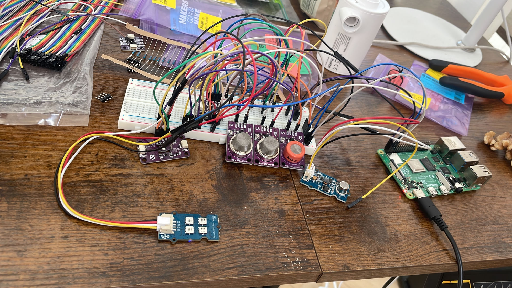
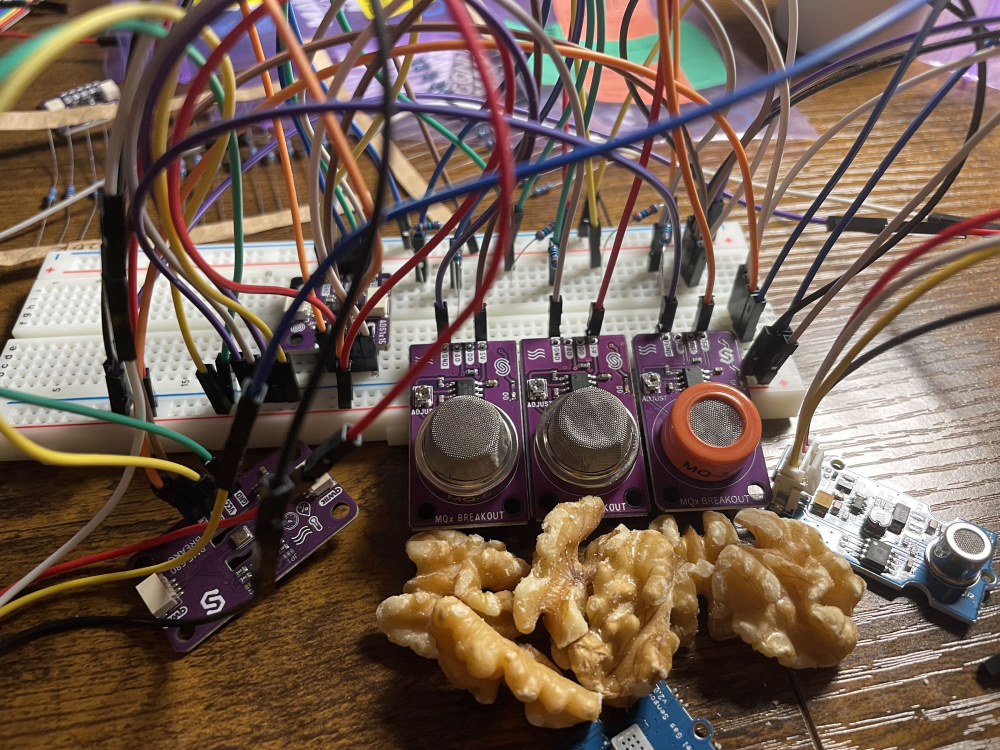

# smell-pi

**Replicating [SmellNet](https://github.com/MIT-MI/SmellNet) on a Raspberry Pi.**



SmellNet (Feng et al., 2025) is the first large-scale open-source dataset for real-world smell recognition using portable gas and chemical sensors. The original study collected data with an Adafruit ESP32 Feather running Arduino firmware. `smell-pi` adapts the full pipeline — sensor collection, preprocessing, model training, and edge inference — to run natively in Python on a Raspberry Pi.

- **Paper**: [SMELLNET: A Large-scale Dataset for Real-world Smell Recognition](https://arxiv.org/abs/2506.00239) (Feng et al., 2025)
- **Original repo**: https://github.com/MIT-MI/SmellNet
- **Dataset**: [SmellNet on Hugging Face](https://huggingface.co/datasets/DeweiFeng/smell-net)

This project is an independent replication effort and is not affiliated with the SmellNet authors.

---

## Goals

1. **Data collection on RPi** — wire the same sensor suite to a Raspberry Pi and produce recordings in the same 12-channel CSV format as SmellNet, without needing an ESP32 or Arduino.
2. **Model training & evaluation** — reimplement ScentFormer (the Transformer baseline from the paper) along with LSTM / CNN / MLP baselines, and benchmark against the paper's 58.5% Top-1 accuracy on the 50-class task.
3. **Edge inference** — run the trained model on-device in real time, streaming live sensor data to predictions.

See [`docs/overview.md`](docs/overview.md) for the full phase plan and how `smell-pi` differs from the original SmellNet setup.

---

## Hardware



The Raspberry Pi has no built-in ADC, so analog MQ sensors are read through an **ADS1115** 16-bit ADC over I2C. All other sensors connect directly.

| Component | Channels | Interface |
|---|---|---|
| Seeed Grove Multichannel Gas Sensor V2 | NO2, C2H5OH, VOC, CO | I2C (0x08) |
| Adafruit BME680 | Temperature, Pressure, Humidity, Gas Resistance | I2C (0x76) |
| MQ-3 / MQ-9 / MQ-135 | Benzene, LPG, Alcohol/CO2 | Analog → ADS1115 (0x48) |

Full wiring diagrams, I2C address map, calibration notes, and BOM live in [`docs/hardware.md`](docs/hardware.md) and [`docs/wiring.md`](docs/wiring.md).

---

## Repository Layout

```
smell-pi/
├── collection/              # RPi data collection scripts (collect.py, test_sensors.py)
├── data/                    # raw CSV recordings (one folder per substance)
│   ├── training/
│   └── testing/
├── src/                     # model code (ScentFormer, LSTM, CNN, MLP, dataset, training)
├── preprocessing/           # FOTD + windowing pipeline
├── training/                # training loops and experiment configs
├── testing/                 # evaluation scripts
├── real_time_testing_nut/   # real-time inference experiments (nuts)
├── real_time_testing_spice/ # real-time inference experiments (spices)
├── artifacts/               # exported edge-ready checkpoint bundles
├── docs/                    # project documentation (see below)
└── autoresearch_smellnet/   # standalone autoresearch / benchmark tooling
```

Documentation in [`docs/`](docs/):

- [`overview.md`](docs/overview.md) — project goals, phase plan, differences from original
- [`hardware.md`](docs/hardware.md) — sensor suite, BOM, calibration
- [`wiring.md`](docs/wiring.md) — pin-level wiring diagrams
- [`data_pipeline.md`](docs/data_pipeline.md) — CSV format, FOTD preprocessing, sliding windows
- [`models.md`](docs/models.md) — ScentFormer and baseline architectures
- [`exported_artifacts.md`](docs/exported_artifacts.md) — edge-ready checkpoint bundles and preprocessing contract
- [`commands.md`](docs/commands.md) — common commands cheat sheet

---

## Quick Start

### 1. Install dependencies (on the Raspberry Pi)

```bash
sudo apt install -y python3-pip i2c-tools
sudo raspi-config   # enable I2C

pip install \
    adafruit-circuitpython-bme680 \
    adafruit-circuitpython-ads1x15 \
    smbus2 RPi.GPIO \
    torch pandas numpy
```

Verify sensors are on the bus:

```bash
i2cdetect -y 1      # expect 0x08 (Seeed), 0x48 (ADS1115), 0x76 (BME680)
python collection/test_sensors.py
```

### 2. Collect data

```bash
# Collect a 2-minute cinnamon training recording at 2 Hz
python collection/collect.py cinnamon --duration 120

# Collect into the testing split
python collection/collect.py cinnamon --split testing --duration 60
```

Recordings land in `data/{split}/{substance}/{substance}_NNN.csv` with the same 12-channel format as SmellNet.

### 3. Train a model

```bash
# Example (see training/ for full configs)
bash run_experiments.sh
```

Model checkpoints are written to `saved_models/`. Edge-ready bundles (TorchScript / ONNX + preprocessing contract) are exported into `artifacts/`.

### 4. Real-time inference

See `real_time_testing_nut/` and `real_time_testing_spice/` for live-streaming inference experiments against the collected checkpoints.

---

## Preprocessing (matches original SmellNet)

1. **Baseline subtraction** — subtract the first row of each recording to remove sensor offset.
2. **First-order temporal difference (FOTD)** — `df.diff(periods=25)` at 2 Hz (= 12.5 s lag), emphasizing rate-of-change over absolute values.
3. **Sliding window** — default window length 100 samples, stride 50.

Details in [`docs/data_pipeline.md`](docs/data_pipeline.md).

---

## Primary Model — ScentFormer

A 4-layer, 8-head Transformer encoder with sinusoidal positional encoding, mean pooling, and a small MLP classifier head. Input shape `(batch, T, 12)`, target: 50 substance classes.

The paper reports **58.5% Top-1 accuracy** on the 50-class single-substance task. Baselines (LSTM / CNN / MLP) are also implemented for comparison. Architecture details in [`docs/models.md`](docs/models.md).

---

## Citation

If you use this work, please cite the original SmellNet paper:

```bibtex
@article{feng2025smellnet,
  title   = {SMELLNET: A Large-scale Dataset for Real-world Smell Recognition},
  author  = {Feng, Dewei and others},
  journal = {arXiv preprint arXiv:2506.00239},
  year    = {2025},
  url     = {https://arxiv.org/abs/2506.00239}
}
```

And a link back to the original implementation: https://github.com/MIT-MI/SmellNet

---

## License

See the original SmellNet repo for dataset and upstream code licensing. Code authored in this repo is released under the same terms unless otherwise noted.
