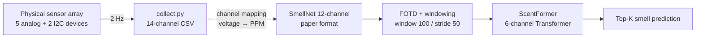

# smell-pi

**A Raspberry Pi port of [SmellNet](https://github.com/MIT-MI/SmellNet) — a 50-class real-world smell classifier built on portable gas sensors.**


SmellNet ([Feng et al., 2025](https://arxiv.org/abs/2506.00239)) is a recent paper on digitizing smell with cheap gas sensors: 50 substances, 68 hours of recordings, a transformer classifier that reaches **58.5% Top-1** on a 50-way task. The original study used an Arduino + ESP32 Feather stack. `smell-pi` rebuilds the same sensor array on a Raspberry Pi and replaces the Arduino firmware with a **pure-Python 2 Hz collection pipeline** — no ESP32, no Arduino IDE, no microcontroller flashing in the loop. The repo ships the hardware rig, the collection stack, and the paper's best supervised checkpoint (`57.97% Top-1 / 88.05% Top-5` on the upstream held-out test set). Bridging that checkpoint to live recordings on a second physical rig is an open calibration problem — analog gas sensors are sensitive to per-rig R0 drift, ambient humidity, and sensor aging, and robust on-device inference is work in progress.

- **Paper**: [SMELLNET: A Large-scale Dataset for Real-world Smell Recognition](https://arxiv.org/abs/2506.00239) (Feng et al., 2025)
- **Upstream repo**: https://github.com/MIT-MI/SmellNet
- **Dataset**: [SmellNet on Hugging Face](https://huggingface.co/datasets/DeweiFeng/smell-net)
- **Sibling repo** (training harness): [`smellnet-autoresearch`](https://github.com/smartinelle/smellnet-autoresearch)

This is an independent engineering project, not affiliated with the SmellNet authors.

---

## What's in the repo today

Three deliverables:

1. **A physical sensor rig.** Raspberry Pi 4, five analog gas sensors (MQ-3, MQ-5, MQ-9, HCHO, Air Quality) read through two ADS1115 16-bit ADC boards, plus a Seeed Multichannel Gas V2 and a BME680 over I2C. Fourteen raw sensor channels, all on a single I2C bus. Full BOM, wiring, and I2C address map in [`docs/hardware.md`](docs/hardware.md).
2. **A pure-Python collection stack.** [`collection/collect.py`](collection/collect.py) drives every sensor at 2 Hz, warms them up, records a timed session, and writes CSVs into `data/{split}/{substance}/`. No Arduino firmware, no ESP32 crosscompile, no serial-port scraping — the whole loop runs natively on the Pi.
3. **A paper-provenance checkpoint.** [`artifacts/smellnet_base_phase2_exact_upstream/`](artifacts/smellnet_base_phase2_exact_upstream/) bundles a 6-channel ScentFormer classifier trained by the sibling [`smellnet-autoresearch`](https://github.com/smartinelle/smellnet-autoresearch) harness on the upstream SmellNet dataset. It reaches **57.97% Top-1 / 88.05% Top-5** on the upstream held-out test set — matching the paper's headline 58.5% baseline. Input contract, label order, and preprocessing parameters are all pinned in [`docs/exported_artifacts.md`](docs/exported_artifacts.md).

---

## Hardware


The Raspberry Pi has no built-in ADC, so analog MQ sensors are read through **two ADS1115** 16-bit ADC boards over I2C. Everything else sits directly on the bus.

| Component | Channels | Interface |
|---|---|---|
| Seeed Grove Multichannel Gas Sensor V2 | NO2, C2H5OH, VOC, CO | I2C (`0x08`) |
| Adafruit BME680 | Temperature, Pressure, Humidity, Gas Resistance, Altitude | I2C (`0x76`) |
| MQ-3 / MQ-5 / MQ-9 + HCHO sensor | Alcohol, LPG / natural gas, CO / flammable gases, formaldehyde | Analog → ADS1115 #1 (`0x48`) |
| Air Quality sensor | General VOC / air quality | Analog → ADS1115 #2 (`0x49`) |

Full wiring diagrams, calibration notes, and the BOM live in [`docs/hardware.md`](docs/hardware.md) and [`docs/wiring.md`](docs/wiring.md).

---

## How it works



The pipeline has three distinct channel layouts — raw collection (14 ch), SmellNet paper format (12 ch), and the exported model's input contract (6 ch). All three are documented explicitly in [`docs/data_pipeline.md`](docs/data_pipeline.md#channel-layers).

**Preprocessing** matches the SmellNet paper exactly: baseline-subtract the first row of each recording, apply a first-order temporal difference (`df.diff(periods=25)` at 2 Hz = a 12.5 s lag), slice into sliding windows of 100 samples with stride 50, standardize with the scaler saved alongside the checkpoint. Details in [`docs/data_pipeline.md`](docs/data_pipeline.md).

**ScentFormer** is a standard Transformer encoder: 4 layers (6 in the exported variant), 8 heads, sinusoidal positional encoding, mean pooling, small MLP classifier head. The exported checkpoint uses `input_dim = 6, model_dim = 512, num_layers = 6, num_heads = 8`. Architecture and baseline models (LSTM / CNN / MLP) are documented in [`docs/models.md`](docs/models.md) and trained in the sibling repo.

The dashed arrow above is the **open step**: smell-pi records raw MQ voltages, but the paper's model expects PPM-converted `Alcohol` / `LPG` channels. That bridge needs per-rig R0 calibration and isn't committed yet — it's the single biggest thing standing between "rig works" and "end-to-end live classification works." See [Roadmap](#roadmap).

---

## Repo layout

```
smell-pi/
├── CLAUDE.md
├── README.md
├── collection/
│   ├── collect.py           # 2 Hz sensor recorder → data/{split}/{substance}/*.csv
│   └── test_sensors.py      # bus sanity check
├── artifacts/
│   └── smellnet_base_phase2_exact_upstream/
│       ├── checkpoint.pt    # 6-channel ScentFormer, 57.97% Top-1
│       ├── labels.json
│       ├── preprocessing.json
│       ├── training_metrics.json
│       └── final_test_metrics.json
└── docs/
    ├── overview.md
    ├── hardware.md
    ├── wiring.md
    ├── data_pipeline.md
    ├── models.md
    ├── exported_artifacts.md
    └── commands.md
```

`data/` is gitignored — raw recordings live only on the Pi that produced them. Training / experiment code lives in the sibling repo [`smellnet-autoresearch`](https://github.com/smartinelle/smellnet-autoresearch).

---

## Quick start

### Install on the Raspberry Pi

```bash
sudo apt install -y python3-pip i2c-tools
sudo raspi-config    # enable I2C

pip install \
    adafruit-circuitpython-bme680 \
    adafruit-circuitpython-ads1x15 \
    smbus2 RPi.GPIO torch pandas numpy
```

### Verify the sensor bus

```bash
i2cdetect -y 1                       # expect 0x08, 0x48, 0x49, 0x76
python collection/test_sensors.py    # full per-sensor diagnostic
```

### Record a session

```bash
# 2 minutes of cinnamon, training split
python collection/collect.py cinnamon --duration 120

# 1 minute of cinnamon, testing split
python collection/collect.py cinnamon --split testing --duration 60
```

Recordings land in `data/{split}/{substance}/{substance}_NNN.csv` with 14 raw sensor channels at 2 Hz.

More commands in [`docs/commands.md`](docs/commands.md).

---

## Roadmap

1. **Per-rig calibration pipeline.** Determine R0 values for each MQ sensor in clean air, and bridge raw ADS1115 voltages to the `Alcohol` / `LPG` PPM channels the exported checkpoint expects. This is the blocker for end-to-end on-device classification.
2. **Real-time inference loop.** A small Python service that ingests the live 2 Hz stream, runs the 100-sample sliding window, applies the preprocessing contract in `preprocessing.json`, and prints top-K predictions. Target: on-device, no workstation in the loop.
3. **Rig-transfer evaluation.** Systematically measure how the upstream checkpoint degrades on a freshly collected, per-rig-calibrated dataset. This is the interesting research question lurking underneath — analog gas-sensor classifiers are notoriously brittle across hardware, and quantifying the gap is valuable in its own right.
4. **Lightweight on-device retraining.** If the transfer gap is large, fine-tune or adapt the upstream checkpoint on a small per-rig dataset before inference.

---

## Attribution & citation

smell-pi is an independent engineering project built on the SmellNet dataset and ScentFormer architecture. All credit for the dataset, the original sensor collection methodology, and the model goes to the SmellNet authors.

```bibtex
@article{feng2025smellnet,
  title   = {SMELLNET: A Large-scale Dataset for Real-world Smell Recognition},
  author  = {Feng, Dewei and others},
  journal = {arXiv preprint arXiv:2506.00239},
  year    = {2025},
  url     = {https://arxiv.org/abs/2506.00239}
}
```

See the upstream [MIT-MI/SmellNet](https://github.com/MIT-MI/SmellNet) repo for dataset and model licensing. Code authored in `smell-pi` is released under the same terms unless otherwise noted.
